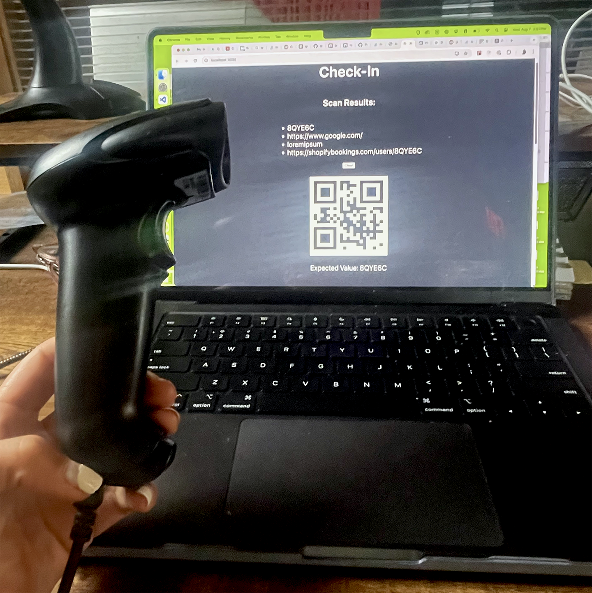

# QR Check In Experiment

A simple web app that is integrated with a physical Barcode / QR code scanner.



# Local Development

This proof-of-concept was bootstrapped with [Create React App](https://github.com/facebook/create-react-app).

To run it locally, use:

```
npm start
```

## Setting up the External Barcode Scanner Device

An external barcode scanner is essentially a keyboard. I purchased [this one from Amazon](https://www.amazon.com/dp/B09897DPKX?psc=1&ref=ppx_yo2ov_dt_b_product_details) for about $30. To set it up, you'll need to connect it to your computer (via a USB cord or Bluetooth dongle), and then follow the steps your operating system requires to pair a keyboard.

Depending on the Scanner you've purchased, this might include downloading a driver, or simply scanning a barcode / QR code in the user manual when the Keyboard Setup Assistant asks you to press the `Shift` key to identify the keyboard. Make sure you scan the code that marks 

#### Helpful Commands

**List usb devices**

Mac OS
```
# macos unix
ioreg -p IOUSB

# windows
wmic path CIM_LogicalDevice where "Description like 'USB%'" get /value

# powershell
Get-PnpDevice -PresentOnly | Where-Object { $_.InstanceId -match '^USB' }
```

Expect to see a line containing `Barcode Scanner@02140000`
```
+-o Root  <class IORegistryEntry, id 0x100000100, retain 37>
  +-o AppleT8122USBXHCI@02000000  <class AppleT8122USBXHCI, id 0x10000050b, registered, matched, active, busy 0 (5002 ms), retain 199>
  | +-o IOUSBHostDevice@02100000  <class IOUSBHostDevice, id 0x10002496d, registered, matched, active, busy 0 (1596 ms), retain 39>
  |   +-o IOUSBHostDevice@02130000  <class IOUSBHostDevice, id 0x10002498b, registered, matched, active, busy 0 (1241 ms), retain 36>
  |   | +-o USB BillBoard@02132000  <class IOUSBHostDevice, id 0x1000249ed, registered, matched, active, busy 0 (282 ms), retain 29>
  |   +-o USB Storage@02120000  <class IOUSBHostDevice, id 0x1000249a9, registered, matched, active, busy 0 (347 ms), retain 29>
  |   +-o Barcode Scanner@02140000  <class IOUSBHostDevice, id 0x100024a41, registered, matched, active, busy 0 (49 ms), retain 37>
  +-o AppleT8122USBXHCI@01000000  <class AppleT8122USBXHCI, id 0x1000004c6, registered, matched, active, busy 0 (4 ms), retain 37>
  +-o AppleT8122USBXHCI@00000000  <class AppleT8122USBXHCI, id 0x1000003a3, registered, matched, active, busy 0 (10528 ms), retain 273>
```

**Restarting the Keyboard Assistant on MacOS**

On Mac OS X, if you press "cancel" and close the Keyboard Setup Assistant without completing the setup, it may be difficult to get the setup assistant to start again. If this happens, disconnect the scanner, and reset your system keyboard preferences by opening the Finder, navigating to Go > Go to Folder, entering `/Library/Preferences/` and then deleting the file `com.apple.keyboardtype.plist`. Next, restart your computer and reconnect the scanner. You should